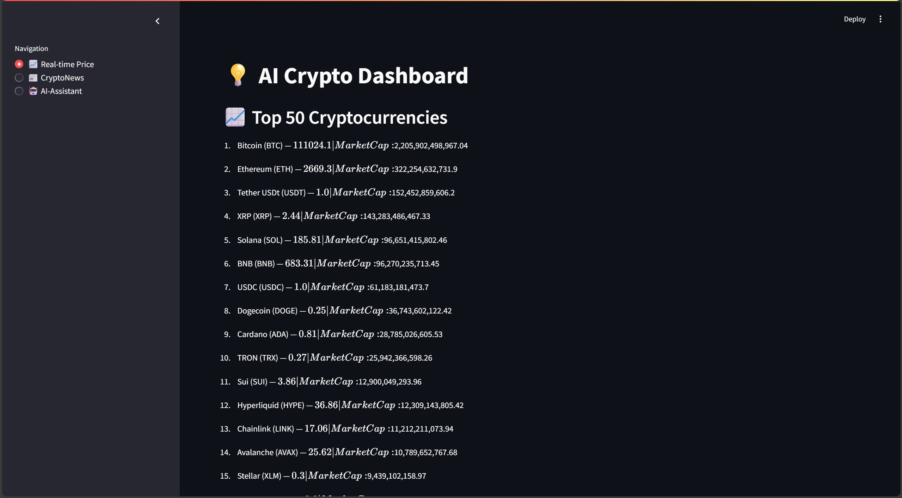
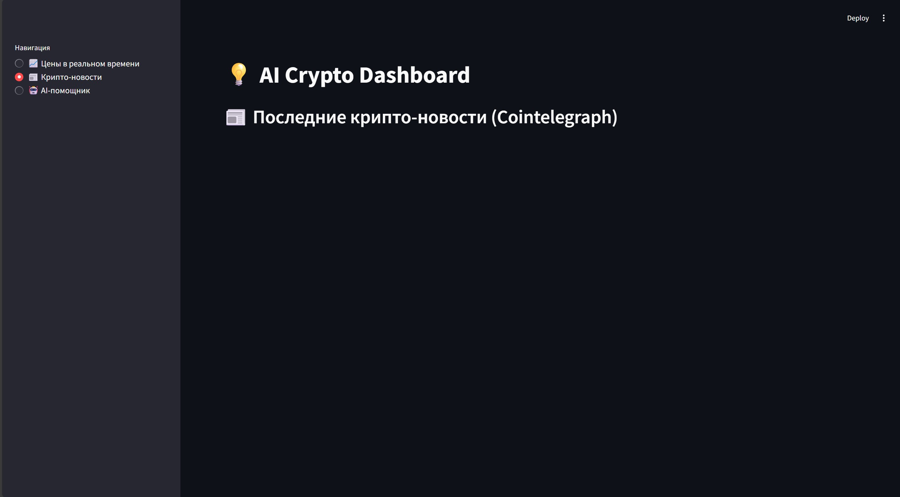
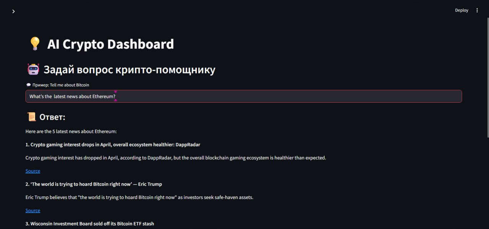
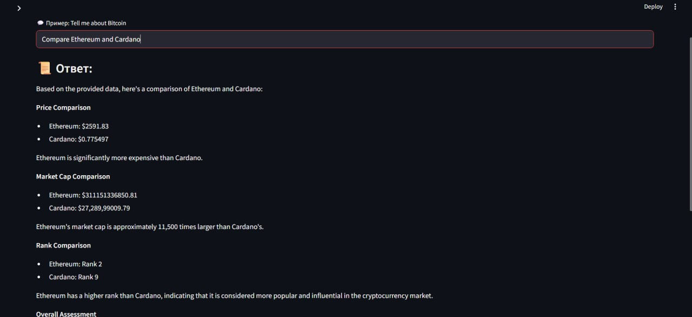
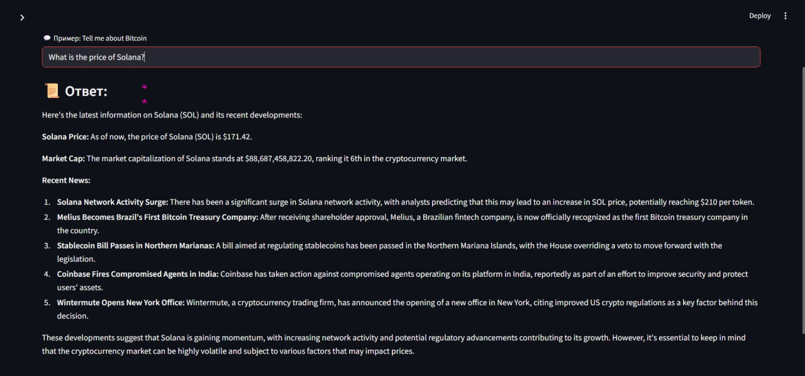
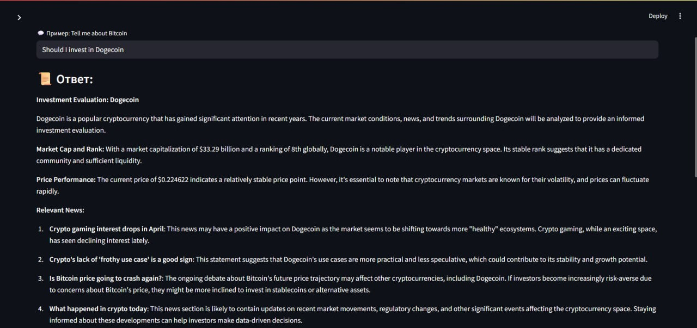
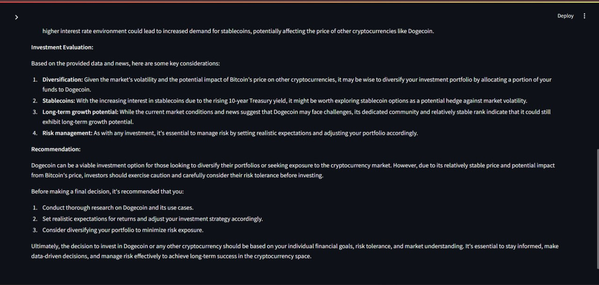

# 🧠 AI Crypto Assistant

AI Crypto Assistant is an intelligent, multi-functional tool that helps you stay ahead in the cryptocurrency world. It provides real-time data, performs semantic news analysis, compares tokens, and responds to your questions using up-to-date insights from trusted sources.

---

## 📸 Screenshots

Take a quick tour of the interface:

| 💹 Prices | 📰 Latest News | 🤖 Assistant | 📊 Coin Comparison |
|:--------:|:--------------:|:------------:|:------------------:|
|  |  |  |  |

| 📈 Token Insights | 💡 Investment Tips | ⚙️ More Features |
|:-----------------:|:------------------:|:----------------:|
|  |  |  |

---

## ✨ Key Capabilities

- 🔍 Retrieve detailed data (price, market cap, rank, description) for the **top 50 cryptocurrencies**
- 🧠 AI-powered **semantic search** for the latest crypto news (Cointelegraph RSS + Ollama)
- ⚖️ Compare any two tokens across price, market cap, and rank
- 📉 View historical trends for market prices and capitalization
- 🌐 Supports queries in **English** and **Russian**
- 📝 Delivers responses in Markdown format, with helpful **source links** and **clear summaries**

#### Example Questions You Can Ask:
- *"What’s the current price of Solana?"*
- *"Show me Ethereum news."*
- *"Compare Cardano with Ethereum."*
- *"Is Dogecoin a good investment?"*

---

## 🚀 How to Get Started

### 1. Clone the repository

```bash
git clone https://github.com/YOUR-USERNAME/YOUR-REPO-NAME.git
cd YOUR-REPO-NAME
```

### 2. Install Python dependencies
```bash
pip install -r requirements.txt
```

### 3. Create your .env file
```bash
touch .env
```
### Then add your API keys (example):
```bash
COINGECKO_API_KEY=your_api_key_here
COINMARKETCAP_API_KEY=your_api_key_here
# Other if needed
```

### 4. Set up and run Ollama locally
```bash
ollama run llama3.2
```

### 5. Launch the application
```bash
streamlit run app.py
```

## 📂 Project Structure
```bash
.
├── app.py                  # Main Streamlit application
├── ai/
│   └── response_gen.py     # Handles queries and AI response logic
├── apis/
│   ├── prices.py           # Interacts with CoinGecko API
│   ├── coinmarketcap.py    # Interacts with CoinMarketCap API
│   └── news.py             # News retrieval and embedding
├── images/                 # Screenshot assets
├── requirements.txt        # List of dependencies
└── .env                    # API keys and secrets (not committed)
```

## ⚠️ Important Notes
- Do NOT hard-code or share your API keys. Always use a .env file.
- Make sure .env is listed in your .gitignore to avoid accidental leaks.
- Ollama must be running locally for the news search feature to work.

## 👥 Authors

**Daniil** & **Bauyrzhan**  
Blockchain Tech — May 2025  